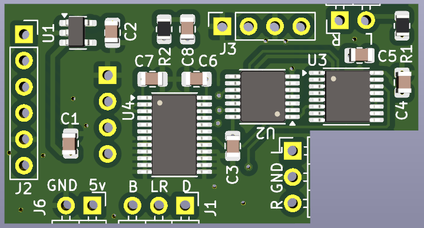
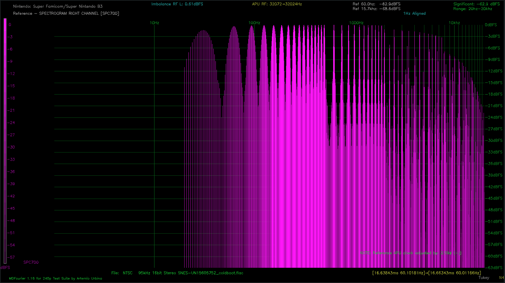

# Super Wave Blaster

A hardware modification for converting 16-bit right-justified (EIAJ/SONY format) digital audio to I2S for use with high-quality PCM5102 DAC modules. Originally designed for the Super Nintendo/Super Famicom, this general-purpose converter also works with other devices like the Nintendo 64.

**MDFourier Measurements comparing to TOSLINK capture**

**Toslink -> Super Wave Blaster**

**Stock -> Super Wave Blaster**

More MDF measurements can be found in the Images directory. 

## Overview

The Super Nintendo uses the UPD6376 audio DAC with a 16-bit **right-justified** digital audio format (also known as EIAJ CD-350, SONY format, or Japanese format). This format uses three serial data lines, similar to the modern I2S standard. The Super Wave Blaster converts right-justified audio to I2S using a series of inverters and bit shifters to realign the digital data stream.

**What Gets Upgraded:**
- **DAC Module:** Upgrades the main audio output from the console's DSP (SPC700 on SNES)
- **Opamp Replacement:** Upgrades the mixed audio signal, which includes both the DSP audio AND external audio sources (cartridge expansion audio like SA-1, Super FX, etc.)

Since this is a general-purpose format converter, it can work with **other devices that output 16-bit right-justified audio**, including the **Nintendo 64**, which outputs the same format at various sample rates.

**Original design inspiration:** [EIAJ to I2S Converter Thread](https://www.diyaudio.com/community/threads/eiaj-to-i2s-converter-and-vice-versa.58564/)

## Features

- Direct digital audio conversion (16-bit right-justified → I2S)
- Compatible with popular PCM5102 DAC modules
- Works with SNES/Super Famicom and other 16-bit right-justified sources (e.g., Nintendo 64)
- Cleaner, higher-fidelity audio output
- Configurable for different SNES revisions
- Optional analog signal chain upgrades

## Installation Overview

1. Install the Super Wave Blaster DAC module
2. (Recommended) Upgrade analog mixing components
3. Configure DAC output settings for your SNES revision
4. Test and enjoy improved audio quality

## Recommended Upgrades

While the DAC replacement provides digital conversion benefits, upgrading the entire analog audio signal chain can have an even greater impact on sound quality. Consider these upgrades for optimal results:

### 1. Mixing Opamp Replacement

**Recommended Models:**
- **OPA1652AIDR** (dual opamp)
- **OPA1654AIDR** (quad opamp)
- Or similar audiophile-grade opamps

**Compatibility by SNES Revision:**
- **SHVC revisions (modular):** Uses two dual LM2904 opamps
- **GPM revisions:** Uses one quad LM324 opamp
- **RGB revisions (S-Mix chip):** Not drop-in compatible - use the [Super ReMix replacement board](https://github.com/RetroLoom/Super-ReMix) for OPA16xx compatibility

**Benefits:** Reduced noise and distortion, particularly in high-frequency detail

### 2. Audio Transistor Upgrade

**Location:** Q16 and Q17 (not present on S-Mix versions)

**Original:** C2412 transistors  
**Recommended:** MMBT5088LT1G transistors

**Advanced Option:** When using OPA16xx series opamps, these transistors can be bypassed entirely for the most accurate sound. The OPA16xx has sufficient drive capability for standard line-level outputs.

**When to keep transistors:**
- Using lower impedance outputs (headphones)
- Driving passive speakers
- Prefer the "colored" sound signature the transistors provide

**Note:** The original transistors were likely included to boost current drive when paired with the weaker LM324 opamp.

### 3. Output Coupling Capacitors

**Original:** 10µF electrolytic capacitors  
**Recommended:** Low-ESR polymer capacitors

**Specific Recommendation:**  
Wurth Elektronik 875105240001
- Capacitance: 10µF
- ESR: 45mΩ
- Diameter: 4mm

⚠️ **Important:** Verify capacitor dimensions for your specific SNES revision before ordering.

## DAC Output Configuration

The DAC module configuration depends on your SNES revision and mixing opamp choice. Select the appropriate configuration below:

### Configuration A: LM324 or OPA16xx Opamps

**Jumper Settings:**
- JP1: **Open**
- JP2: **Open**

**Resistors:**
- R3, R4: **Do not populate**
- R5, R6: **24kΩ** (for unity gain from PCM5102A)

**Gain Control:** Adjusted via R5/R6 and opamp feedback resistors

---

### Configuration B: S-Mix Chip

**Jumper Settings:**
- JP1: **Closed**
- JP2: **Closed**

**Resistors:**
- R3, R4: **10kΩ**
- R5, R6: **Do not populate**

**Capacitors:**
- C15, C16: **470pF** (replaces default values)

**Important:** The S-Mix has its own gain network. The voltage divider created by R3/R4 prevents clipping and overdriving the signal.

## Bill of Materials

### Core DAC Module Components (Both Configurations)

| Designator | Component | Value/Part | Package | Qty | Notes |
|------------|-----------|------------|---------|-----|-------|
| U5 | DAC | PCM5102A | TSSOP-20 | 1 | Main I2S DAC chip |
| U2 | Inverter | CD74HCT14PWR | TSSOP-14 | 1 | Schmitt trigger hex inverter |
| U3 | Shift Register | SN74HC595PWR | TSSOP-16 | 1 | 8-bit shift register |
| U4 | Level Shifter | SN74LVC8T245PWR | TSSOP-24 | 1 | 8-bit dual-supply translator |
| U1 | Voltage Regulator | TLV73333PDBV | SOT-23-5 | 1 | 3.3V LDO regulator |
| C1, C2 | Capacitor | 10µF | 0805 | 2 | Power supply filtering |
| C3-C11 | Capacitor | 0.1µF | 0805 | 8 | Decoupling capacitors |
| C12, C10 | Capacitor | 2.2µF | 0805 | 2 | Additional filtering |
| R1-R2 | Resistor | 470Ω | 0805 | 2 | Series/termination resistors |
| JP1, JP2 | Solder Jumper | - | 2mm pitch | 2 | Configuration selection |

### Configuration-Specific Components

#### Configuration A: LM324 / OPA16xx Opamps

**Jumper Settings:** JP1 **Open**, JP2 **Open**

| Designator | Component | Value | Package | Qty | Notes |
|------------|-----------|-------|---------|-----|-------|
| R3, R4 | Resistor | - | 0805 | 0 | **Do not populate** |
| R5, R6 | Resistor | **24kΩ** | 0805 | 2 | Unity gain from PCM5102A |
| C15, C16 | Capacitor | 2.2nF | 0805 | 2 | low pass filter cap |
| C13, C14 | Capacitor | **1µF, X7R** | 0805 | 2 | Opamp input coupling |

#### Configuration B: S-Mix Chip

**Jumper Settings:** JP1 **Closed**, JP2 **Closed**

| Designator | Component | Value | Package | Qty | Notes |
|------------|-----------|-------|---------|-----|-------|
| R1, R2 | Resistor | **20kΩ** | 0805 | 2 | **Only for S-Mix (Config B)** -voltage divider |
| R3, R4 | Resistor | 10kΩ | 0805 | 2 | **Only for S-Mix (Config B)** - voltage divider |
| R5, R6 | Resistor | **0Ω** (optional) | 0805 | 2 | Jumper 1 and 2 to bypass |
| C15, C16 | Capacitor | **470pF** | 0805 | 2 | **Replace default 2.2nF** |
| C13, C14 | Capacitor | **0.1µF, X7R** | 0805 | 2 | S-Mix input coupling |

**All Resistors:**
- Size: 0805 (2012 metric)
- Power: 1/8W minimum
- Tolerance: 1% recommended for better channel matching

**Full BOM Available:**
Mouser Project: [View Complete BOM](https://www.mouser.com/Tools/Project/Details?projectGUID=576ace13-fcfc-4374-9011-b2b0ae4ebff9)

⚠️ **Important:** The Mouser project includes components for multiple SNES revisions and both configurations. Select components based on your specific console revision and chosen configuration (A or B).

## Revision Compatibility

| SNES Revision | Opamp Type | Configuration | Notes |
|---------------|------------|---------------|-------|
| SHVC (Modular) | 2× LM2904 (dual) | A | Standard upgrade path |
| GPM | 1× LM324 (quad) | A | Standard upgrade path |
| RGB (S-Mix) | S-Mix chip | B | Requires voltage divider, or use [Super ReMix replacement](https://github.com/RetroLoom/Super-ReMix) |

## Other Compatible Devices

Since the Super Wave Blaster is a general-purpose **16-bit right-justified to I2S converter**, it can work with other gaming consoles and devices that output audio in the same format:

**Nintendo 64:**
- Outputs 16-bit right-justified audio at various sample rates (22.05 kHz to 48 kHz depending on the game)
- Successfully tested with SNES digital audio mods
- Requires tapping the digital audio signals from the N64's audio DAC
- Consider adding series termination resistors at the RCP's digital audio output for improved signal integrity

**Note:** Installation methods and connection points will vary by device. Consult device-specific documentation for proper digital audio tap points.

## Troubleshooting

**No audio output:**
- Verify jumper settings match your revision
- Check DAC module power connections
- Confirm proper solder joints

**Audio too loud/clipping:**
- S-Mix users: Ensure R3/R4 are populated and JP1/JP2 are closed
- Check C15/C16 values (470pF for S-Mix)

**Audio too quiet:**
- LM324/OPA users: Verify JP1/JP2 are open
- Check R5/R6 values (24kΩ for unity gain)

## Contributing

Contributions, suggestions, and improvements are welcome! Please open an issue or pull request.

## Disclaimer and Warranty

**This project is provided "as-is" without any warranty of any kind, either expressed or implied.**

By using this modification, you acknowledge and agree that:

- This is an **experimental hardware modification** that requires soldering and electronics knowledge
- Installation may **void your console's warranty** (if still applicable)
- Improper installation can **damage your console** permanently
- The author(s) are **not responsible** for any damage to your equipment, including but not limited to:
  - Damage to the gaming console
  - Damage to connected audio equipment
  - Loss of game saves or data
  - Personal injury from soldering equipment
- **You perform this modification at your own risk**
- Different console revisions may have different requirements - verify compatibility before proceeding
- While this design has been tested, **results may vary** based on your specific hardware revision, component quality, and installation skill
- The author(s) provide **no guarantee** that this modification will work with your specific console or meet your expectations

**Recommendation:** If you are uncomfortable with electronics modification or soldering surface-mount components, consider seeking assistance from a professional modding service.

## License

The hardware portions of this repository are licensed under the **CERN OHL version 2 - Strongly Reciprocal**.

[Full License Text](https://ohwr.org/project/cernohl/-/wikis/uploads/819d71bea3458f71fba6cf4fb0f2de6b/cern_ohl_s_v2.txt)

**Note:** This license allows you to use, modify, and distribute this hardware design, but any modifications or derivative works must also be released under the same license.

## Acknowledgments

- Original EIAJ to I2S conversion circuit design from the [diyaudio.com community](https://www.diyaudio.com/community/threads/eiaj-to-i2s-converter-and-vice-versa.58564/)
- Super Nintendo/Famicom hardware community

---

**Questions or issues?** Please open a GitHub issue for support.